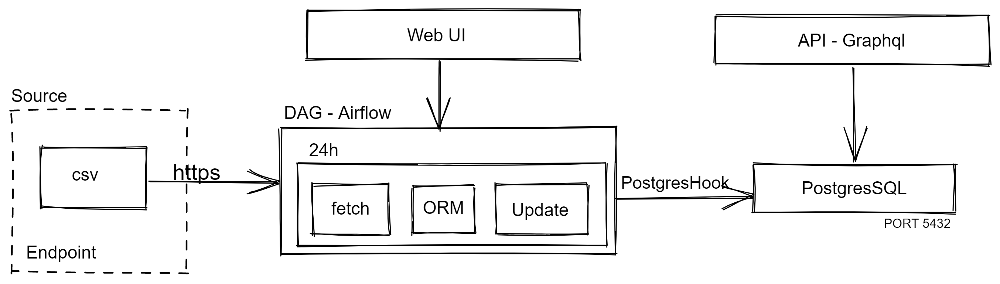

# Airflow and DataWarehouse

  

## Description

* Daily data ingestion using Airflow scheduler and DAGs. An implementation of Airflow with kubernetes is considered appropiate for production workloads
* The datawarehouse was choose to be postgres on Docker container with persistent local volume. Not recommended in production.

## Usage

- Prepare Docker Environment
- make build_airflow
- make buil_datawarehouse
- make buil_app

## Monitoring

- Airflow Web-UI on http://localhost:8080
- Graphql interface to query database http://localhost:8000/fireincidents/